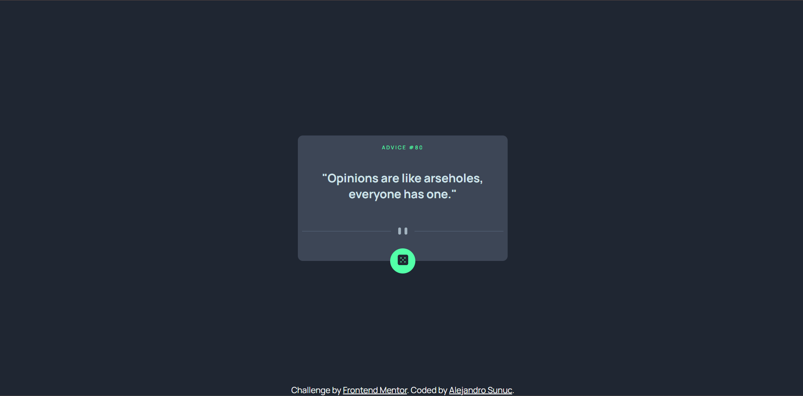

# Frontend Mentor - Advice generator app solution

This is a solution to the [Advice generator app challenge on Frontend Mentor](https://www.frontendmentor.io/challenges/advice-generator-app-QdUG-13db). Frontend Mentor challenges help you improve your coding skills by building realistic projects.

## Table of contents

- [Overview](#overview)
  - [The challenge](#the-challenge)
  - [Screenshot](#screenshot)
  - [Links](#links)
- [My process](#my-process)
  - [Built with](#built-with)
  - [What I learned](#what-i-learned)
  - [Continued development](#continued-development)
  - [Useful resources](#useful-resources)
- [Author](#author)


## Overview

### The challenge

Users should be able to:

- View the optimal layout for the app depending on their device's screen size
- See hover states for all interactive elements on the page
- Generate a new piece of advice by clicking the dice icon

### Screenshot



### Links

- Solution URL: [Add solution URL here](https://github.com/AlejandroIMP/Advice-generator-app)
- Live Site URL: [Add live site URL here](https://advice-generator-app-guon.vercel.app/)

## My process

### Built with

- Semantic HTML5 markup
- CSS
- SCSS
- CSS Grid
- Mobile-first workflow
- [React](https://reactjs.org/) - JS library
- [@vitejs/plugin-react](https://github.com/vitejs/vite-plugin-react/blob/main/packages/plugin-react/README.md) uses [Babel](https://babeljs.io/) for Fast Refresh
- [@vitejs/plugin-react-swc](https://github.com/vitejs/vite-plugin-react-swc) uses [SWC](https://swc.rs/) for Fast Refresh

### What I learned

I learned to use an API, used Hooks of react like useEffect and useState, also I practice the async-await to fetch the api 
```js
    useEffect(() => {
        fetch('https://api.adviceslip.com/advice')
        .then(response => response.json())
        .then(data => {
            setQuote(data.slip.advice)
            setId(data.slip.id)
        })
    }, []
    )
```
```js
    const fetchRandomQuote = async () => {
        try{
            const response = await fetch('https://api.adviceslip.com/advice')
            const data = await response.json()
            setQuote(data.slip.advice)
            setId(data.slip.id)
        }
        catch(err){
            setQuote(err)
            setID("0")
        }
    }
```


### Continued development

I want to continue development in React JS, I'm going to learn how to improve the order of my folders so that it's not so confusing.

### Useful resources

- [Fetching an API](https://www.escuelafrontend.com/data-fetching-con-react) - This help to learn how I can use fetch.

## Author

- Website - [Alejandro Sunuc](https://alejandro-portfolio.com)
- Frontend Mentor - [@AlejandroIMP](https://www.frontendmentor.io/profile/AlejandroIMP)
- Twitter - [@AlejandroRtw](https://x.com/AlejandroRtw)


